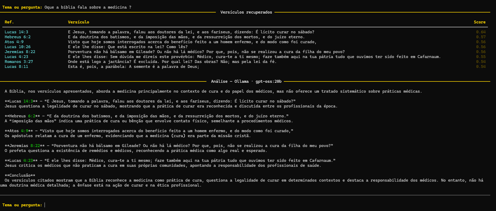
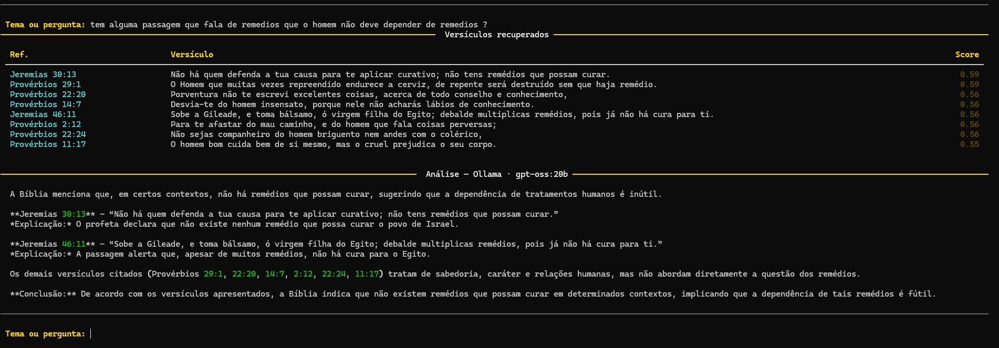
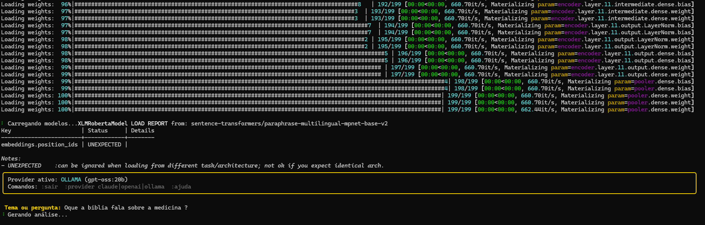

# 📖 VerbumAI





> Busca semântica na Bíblia com RAG, encontre passagens por tema, sem inventar nada.

**VerbumAI** usa embeddings multilingues e um banco vetorial para encontrar os versículos mais relevantes para qualquer tema, e então usa um LLM para explicar cada passagem de forma fiel ao texto bíblico.

```
$ verbum ask "o que Deus fala sobre saúde e cura"

  [0.81] Jeremias 33:6   — "Eis que lhe trarei saúde e cura..."
  [0.79] Êxodo 15:26     — "...porque eu sou o Senhor que te sara."
  [0.77] Tiago 5:14      — "...orem sobre ele, ungindo-o com azeite..."
  [0.74] Mateus 9:35     — "...sarando toda a enfermidade entre o povo."
  ...

  Análise:
  A Bíblia aborda a cura principalmente como um ato divino direto...
```

---

## Estrutura do projeto

```
VerbumAI/
│
├── verbum/                  ← Pacote principal
│   ├── config.py            ← Configuração centralizada (.env)
│   ├── indexer.py           ← Download da Bíblia + indexação no ChromaDB
│   ├── retriever.py         ← Busca semântica (embeddings + ChromaDB)
│   ├── prompts.py           ← Templates de prompts para o LLM
│   ├── pipeline.py          ← Orquestração RAG (retrieval → contexto → LLM)
│   │
│   ├── providers/           ← Adaptadores de LLM
│   │   ├── base.py          ← Interface abstrata (BaseProvider)
│   │   ├── claude.py        ← Anthropic Claude
│   │   ├── openai_.py       ← OpenAI GPT
│   │   └── ollama.py        ← Ollama (modelos locais)
│   │
│   ├── cli/
│   │   └── main.py          ← CLI (Typer + Rich)
│   │
│   └── api/
│       └── server.py        ← API REST opcional (FastAPI)
│
├── data/                    ← Gerado automaticamente (gitignored)
│   ├── bible_acf.json       ← Bíblia ACF em JSON
│   └── chroma_db/           ← Banco vetorial
│
├── pyproject.toml           ← Pacote Python moderno
├── Makefile                 ← Atalhos para tarefas comuns
├── .env.example             ← Template de configuração
└── README.md
```

---

## Instalação

### Pré-requisitos
- Python 3.10+
- (Opcional) [Ollama](https://ollama.com) para rodar modelos locais

### 1. Clone o repositório
```bash
git clone https://github.com/IMNascimento/VerbumAI.git
cd VerbumAI
```

### 2. Instale com Make (recomendado)
```bash
make install
```

### Ou manualmente:
```bash
python -m venv .venv
source .venv/bin/activate      # Linux/Mac
# .venv\Scripts\activate       # Windows

pip install -e .
```

### 3. Configure as credenciais
```bash
cp .env.example .env
# Edite o .env com suas chaves de API e preferências
```

### 4. Indexe a Bíblia (apenas uma vez)
```bash
make setup
# ou:
verbum setup
```

Isso irá:
- Baixar a Bíblia ACF (domínio público) em JSON
- Baixar o modelo de embedding multilíngue (~420 MB, apenas na 1ª vez)
- Indexar ~31.000 versículos no banco vetorial ChromaDB

---

## Como usar

### CLI — Modo interativo
```bash
verbum query                      # usa provider do .env
verbum query --provider ollama    # força uso de modelo local
```

Comandos dentro do modo interativo:
```
:provider claude    → troca para Claude
:provider openai    → troca para GPT-4o
:provider ollama    → troca para modelo local
:sair               → encerra
:ajuda              → mostra ajuda
```

### CLI — Consulta direta
```bash
verbum ask "o que Deus fala sobre saúde e cura"
verbum ask "perdão dos pecados" --provider openai
verbum ask "amor ao próximo"    --provider ollama
verbum ask "riqueza e dinheiro" --top-k 12
```


Utilização Local gratuita com modelos abertos do Ollama:


---

## Providers de LLM

### Claude (Anthropic)
```env
ANTHROPIC_API_KEY=sk-ant-...
VERBUM_PROVIDER=claude
VERBUM_CLAUDE_MODEL=claude-opus-4-6
```

### OpenAI (GPT)
```env
OPENAI_API_KEY=sk-...
VERBUM_PROVIDER=openai
VERBUM_OPENAI_MODEL=gpt-4o
```

### Ollama — 100% local, sem internet, sem custo
```bash
# 1. Instale o Ollama: https://ollama.com/download
# 2. Baixe um modelo
ollama pull llama3.2      # ~2 GB — bom para português
ollama pull mistral       # ~4 GB — ótimo para análise
ollama pull phi4          # ~8 GB — excelente qualidade
```


```env
VERBUM_PROVIDER=ollama
VERBUM_OLLAMA_MODEL=llama3.2
```

> O modelo de **embedding** roda sempre **local**, independente do provider escolhido.
> Apenas a geração de resposta usa API externa ou Ollama.

---

## API REST (opcional)

```bash
pip install -e ".[api]"
make serve
# ou: uvicorn verbum.api.server:app --reload --port 8000
```

Documentação interativa: **http://localhost:8000/docs**

```bash
# Exemplo de chamada
curl -s -X POST http://localhost:8000/query \
  -H "Content-Type: application/json" \
  -d '{"query": "o que a Bíblia fala sobre medicina", "provider": "claude"}' \
  | python -m json.tool
```

---

## Como funciona

```
Pergunta do usuário
        │
        ▼
┌─────────────────────────────────────┐
│  Embedding da query                 │
│  sentence-transformers (local)      │
└─────────────────────────────────────┘
        │
        ▼
┌─────────────────────────────────────┐
│  Busca semântica — ChromaDB         │
│  ~31.000 versículos indexados       │
│  → Retorna os N mais similares      │
└─────────────────────────────────────┘
        │
        ▼
┌─────────────────────────────────────┐
│  Montagem do contexto               │
│  versículos + referências           │
└─────────────────────────────────────┘
        │
        ▼
┌─────────────────────────────────────┐
│  LLM (Claude / GPT / Ollama)        │
│  Prompt estrito:                    │
│  "Só explique o que está escrito"   │
└─────────────────────────────────────┘
        │
        ▼
   Resposta com:
   ✅ Referências exatas (Livro Cap:Ver)
   ✅ Texto do versículo
   ✅ Explicação breve e fiel
   ✅ "Não encontrado" se não houver
```

---

## Configuração avançada

| Variável | Padrão | Descrição |
|---|---|---|
| `VERBUM_PROVIDER` | `claude` | Provider padrão |
| `VERBUM_TOP_K_RETRIEVAL` | `20` | Versículos buscados antes de filtrar |
| `VERBUM_TOP_K_CONTEXT` | `8` | Versículos enviados ao LLM |
| `VERBUM_EMBEDDING_MODEL` | `paraphrase-multilingual-mpnet-base-v2` | Modelo de embedding |
| `VERBUM_DB_PATH` | `data/chroma_db` | Localização do banco vetorial |

Para maior cobertura de busca:
```env
VERBUM_TOP_K_RETRIEVAL=40
VERBUM_TOP_K_CONTEXT=15
```

---

## Sobre a Bíblia

| | |
|---|---|
| **Versão** | Almeida Corrigida e Revisada (ACF) |
| **Idioma** | Português |
| **Licença** | Domínio Público |
| **Versículos** | ~31.102 em 66 livros |
| **Fonte** | [github.com/thiagobodruk/biblia](https://github.com/thiagobodruk/biblia) |

---

## Princípio fundamental

O VerbumAI **nunca inventa** versículos ou referências.

O sistema opera com um prompt estrito que instrui o LLM a:
1. Responder **apenas** com base nos versículos recuperados
2. Citar **sempre** a referência exata de cada passagem usada
3. Declarar **explicitamente** quando não encontrar passagens relevantes

Se a Bíblia não falar sobre o tema consultado, o VerbumAI diz isso claramente.

---

## Makefile — comandos disponíveis

```bash
make install      # Instala dependências em venv
make install-dev  # Instala com dependências de desenvolvimento
make install-api  # Instala dependências da API REST
make setup        # Indexa a Bíblia (rode uma vez)
make query        # Modo interativo
make serve        # Sobe a API REST
make clean        # Remove banco vetorial
make clean-all    # Remove banco vetorial + venv + dados
```


---

## Contribuindo

Contribuições são bem-vindas! Por favor, siga as diretrizes em CONTRIBUTING.md para fazer um pull request.

## Licença

Distribuído sob a licença MIT. Veja LICENSE para mais informações.

## Autores

Igor Nascimento - Desenvolvedor Principal - [github.com/IMNascimento](https://github.com/IMNascimento)
